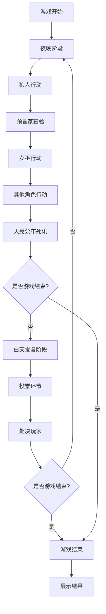
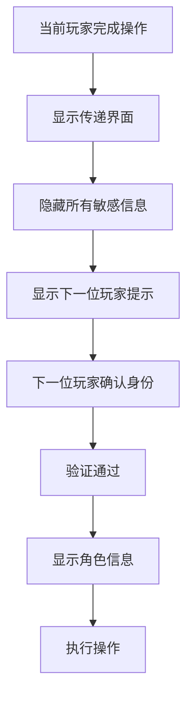

# 狼人杀游戏应用 - 产品需求文档 (PRD)

## 1. 产品概述

一款专为线下狼人杀游戏设计的单设备Web应用，完全替代传统法官角色，实现4-10人在同一设备上完成完整狼人杀游戏体验。采用设备传递模式，确保每个玩家只能看到自己的角色信息，保护游戏公平性。

## 2. 核心功能

### 2.1 用户角色
| 角色 | 说明 |
|------|------|
| 游戏主持人 | 设备持有者，负责初始化游戏配置 |
| 玩家 | 游戏参与者，通过设备传递查看角色和执行操作 |

### 2.2 功能模块

1. **首页**: 游戏介绍、快速开始、规则说明
2. **游戏配置页**: 人数设置、角色配置、高级选项
3. **角色分配页**: 玩家登记、角色分配确认
4. **游戏进行页**: 夜晚阶段、白天阶段、投票环节
5. **结果页**: 胜负展示、身份揭示、游戏复盘

### 2.3 页面详情

| 页面名称 | 模块名称 | 功能描述 |
|---------|---------|---------|
| 首页 | 游戏入口 | 开始新游戏、继续游戏、规则说明入口 |
| 首页 | 角色介绍 | 展示所有角色卡片及技能说明 |
| 游戏配置页 | 人数选择 | 4-10人滑块选择，显示推荐配置 |
| 游戏配置页 | 角色配置 | 自定义各角色数量，显示阵营比例 |
| 游戏配置页 | 高级设置 | 游戏难度、特殊规则、计时器设置 |
| 角色分配页 | 玩家登记 | 输入玩家姓名，生成玩家列表 |
| 角色分配页 | 角色分配 | 随机分配角色，逐一私密确认 |
| 游戏进行页 | 夜晚阶段 | 按顺序引导各角色行动，语音播报 |
| 游戏进行页 | 白天阶段 | 发言计时、投票引导、结果公布 |
| 游戏进行页 | 传递界面 | 设备传递确认，隐私保护界面 |
| 结果页 | 胜负展示 | 显示获胜阵营和所有玩家身份 |
| 结果页 | 游戏复盘 | 展示游戏过程关键事件时间线 |

## 3. 核心流程

### 3.1 游戏初始化流程
玩家设置人数 → 配置角色 → 登记玩家姓名 → 随机分配角色 → 逐一确认角色

### 3.2 游戏进行流程

### 3.3 设备传递流程

## 4. 用户界面设计

### 4.1 设计风格
- **主色调**: 深色神秘风格（深紫/暗红/黑色渐变）
- **辅助色**: 金色（强调）、白色（文字）、灰色（背景）
- **按钮风格**: 圆角按钮，带有微妙阴影和悬停效果
- **字体**: 思源黑体/苹方（中文），数字使用等宽字体
- **布局**: 卡片式布局，居中对齐
- **图标**: 简洁线性图标，配合角色主题

### 4.2 页面设计概览

| 页面名称 | 模块名称 | UI元素 |
|---------|---------|--------|
| 首页 | 游戏入口 | 全屏背景、大标题、开始按钮、规则入口 |
| 首页 | 角色介绍 | 横向滚动卡片、角色图标、技能说明 |
| 游戏配置页 | 人数选择 | 大号滑块、人数显示、推荐标签 |
| 游戏配置页 | 角色配置 | 角色图标网格、加减按钮、阵营比例条 |
| 角色分配页 | 玩家登记 | 输入框列表、添加按钮、随机排序 |
| 角色分配页 | 角色分配 | 玩家卡片、确认按钮、遮罩层 |
| 游戏进行页 | 夜晚阶段 | 深色背景、角色图标、行动按钮、计时器 |
| 游戏进行页 | 白天阶段 | 玩家列表、发言计时、投票按钮 |
| 游戏进行页 | 传递界面 | 中立背景、玩家提示、确认按钮 |
| 结果页 | 胜负展示 | 大号标题、阵营图标、玩家列表 |

### 4.3 响应式设计
- 移动优先设计，适配375px-768px屏幕宽度
- 支持横屏和竖屏模式
- 触摸优化，按钮最小点击区域44px
- 防误触设计，关键操作需二次确认

### 4.4 隐私保护设计
- 角色信息显示时添加半透明遮罩
- 传递界面使用中性颜色，不显示任何角色信息
- 角色卡片显示区域限制在屏幕中央小范围
- 提供"防偷窥模式"开关，启用后角色信息更隐蔽

## 5. 角色体系

### 5.1 狼人阵营
| 角色 | 技能 | 行动时机 |
|------|------|---------|
| 狼人 | 夜晚可以杀死一名玩家 | 夜晚第一阶段 |
| 狼王 | 死亡时可以带走一名玩家 | 死亡时触发 |

### 5.2 好人阵营
| 角色 | 技能 | 行动时机 |
|------|------|---------|
| 村民 | 无特殊技能 | - |
| 预言家 | 夜晚可以查验一名玩家身份 | 夜晚第二阶段 |
| 女巫 | 拥有一瓶解药和一瓶毒药 | 夜晚第三阶段 |
| 猎人 | 死亡时可以开枪带走一名玩家 | 死亡时触发 |
| 白痴 | 被投票出局时可以翻牌免死 | 投票出局时 |

### 5.3 角色配置推荐

| 玩家人数 | 狼人 | 村民 | 预言家 | 女巫 | 猎人 | 白痴 |
|---------|------|------|--------|------|------|------|
| 4人 | 1 | 2 | 1 | - | - | - |
| 5人 | 1 | 2 | 1 | 1 | - | - |
| 6人 | 2 | 2 | 1 | 1 | - | - |
| 7人 | 2 | 3 | 1 | 1 | - | - |
| 8人 | 2 | 3 | 1 | 1 | 1 | - |
| 9人 | 3 | 3 | 1 | 1 | 1 | - |
| 10人 | 3 | 3 | 1 | 1 | 1 | 1 |

## 6. 游戏规则

### 6.1 夜晚行动顺序
1. 狼人睁眼，选择击杀目标
2. 预言家睁眼，选择查验目标
3. 女巫睁眼，选择使用解药或毒药
4. 其他特殊角色行动（如有）

### 6.2 白天流程
1. 法官宣布昨晚死讯
2. 幸存玩家依次发言
3. 发言结束后进行投票
4. 统计票数，最高票玩家出局
5. 出局玩家发表遗言

### 6.3 胜利条件
- **狼人阵营胜利**: 狼人数量 ≥ 好人数量
- **好人阵营胜利**: 所有狼人被消灭

## 7. 技术特性

### 7.1 离线支持
- 使用Service Worker缓存所有资源
- 游戏数据存储在LocalStorage
- 无需网络即可完整运行

### 7.2 数据安全
- 角色分配信息加密存储
- 传递界面自动清除敏感信息
- 防止浏览器历史记录泄露

### 7.3 语音播报
- 使用Web Speech API
- 支持普通话语音
- 可调节音量和语速
- 提供文字提示备份

### 7.4 游戏存档
- 自动保存游戏进度
- 支持暂停和恢复
- 防止意外中断丢失数据