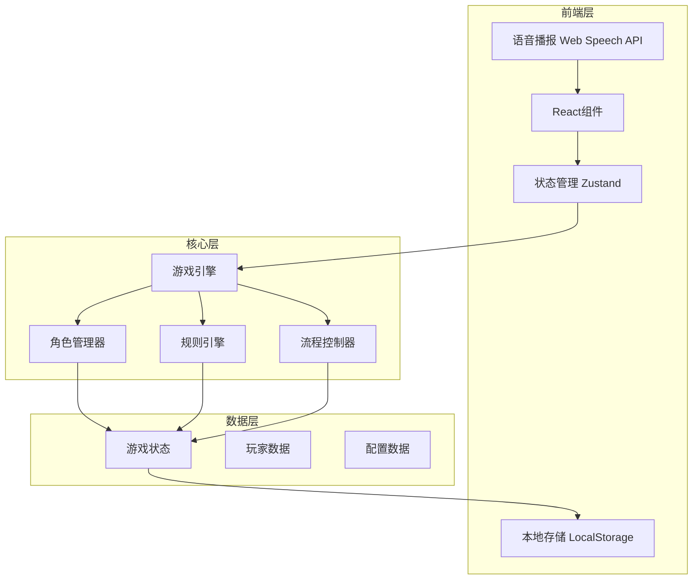
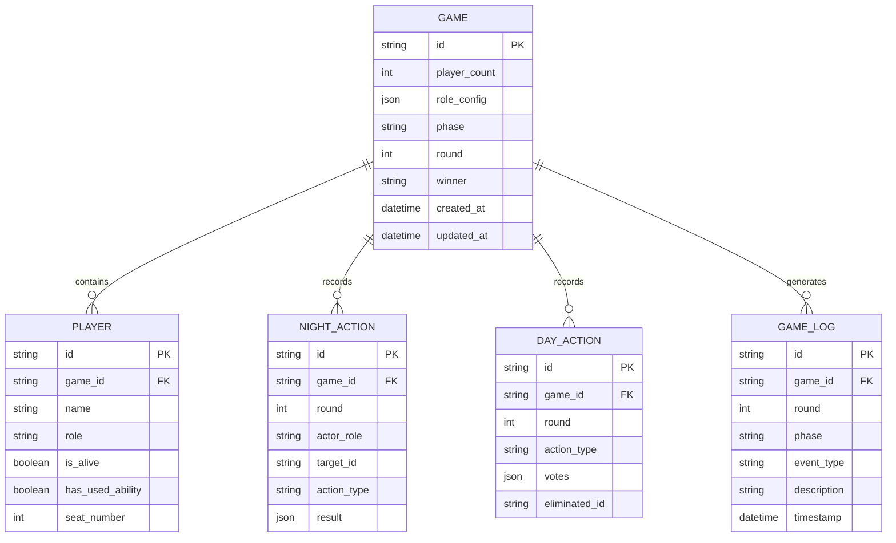

# 狼人杀游戏应用 - 技术架构文档

## 1. 架构设计



## 2. 技术栈说明

- **前端框架**: React 18 + TypeScript
- **样式方案**: Tailwind CSS 3
- **构建工具**: Vite
- **状态管理**: Zustand (轻量级状态管理)
- **语音播报**: Web Speech API (浏览器原生)
- **本地存储**: LocalStorage + 加密
- **图标库**: Lucide React
- **动画库**: Framer Motion

## 3. 路由定义

| 路由 | 用途 |
|------|------|
| `/` | 首页 - 游戏入口和角色介绍 |
| `/setup` | 游戏配置 - 人数和角色设置 |
| `/players` | 玩家登记 - 输入玩家姓名 |
| `/assign` | 角色分配 - 随机分配并确认 |
| `/game` | 游戏进行 - 夜晚/白天阶段 |
| `/result` | 游戏结果 - 胜负和复盘 |

## 4. 核心模块设计

### 4.1 游戏状态管理

```typescript
interface GameState {
  // 游戏配置
  playerCount: number;
  roleConfig: Record<RoleType, number>;
  
  // 玩家信息
  players: Player[];
  currentPlayerIndex: number;
  
  // 游戏进程
  phase: 'setup' | 'night' | 'day' | 'vote' | 'result';
  round: number;
  nightActions: NightAction[];
  dayActions: DayAction[];
  
  // 游戏结果
  winner: 'werewolf' | 'villager' | null;
  gameLog: GameLogEntry[];
}

interface Player {
  id: string;
  name: string;
  role: RoleType;
  isAlive: boolean;
  hasUsedAbility: boolean;
}

type RoleType = 'werewolf' | 'villager' | 'seer' | 'witch' | 'hunter' | 'idiot' | 'wolfKing';
```

### 4.2 角色系统

```typescript
interface Role {
  type: RoleType;
  name: string;
  camp: 'werewolf' | 'villager';
  description: string;
  skill: string;
  actionOrder: number; // 夜晚行动顺序
  canActAtNight: boolean;
  canActAtDay: boolean;
  icon: string;
}

// 角色配置
const ROLES: Record<RoleType, Role> = {
  werewolf: {
    type: 'werewolf',
    name: '狼人',
    camp: 'werewolf',
    description: '每晚可以杀死一名玩家',
    skill: '猎杀：每晚选择一名玩家将其杀死',
    actionOrder: 1,
    canActAtNight: true,
    canActAtDay: false,
    icon: '🐺'
  },
  // ... 其他角色
};
```

### 4.3 游戏流程控制

```typescript
class GameFlowController {
  // 夜晚流程
  async executeNightPhase(): Promise<void> {
    // 1. 狼人行动
    await this.werewolfAction();
    // 2. 预言家行动
    await this.seerAction();
    // 3. 女巫行动
    await this.witchAction();
    // 4. 其他角色行动
    await this.otherActions();
    // 5. 结算夜晚结果
    this.resolveNightResult();
  }
  
  // 白天流程
  async executeDayPhase(): Promise<void> {
    // 1. 公布死讯
    await this.announceDeaths();
    // 2. 检查游戏结束
    if (this.checkGameEnd()) return;
    // 3. 发言阶段
    await this.speechPhase();
    // 4. 投票阶段
    await this.votePhase();
    // 5. 处决结算
    this.resolveVoteResult();
  }
}
```

## 5. 数据模型

### 5.1 数据模型定义



### 5.2 本地存储结构

```typescript
interface StorageData {
  currentGame: GameState | null;
  savedGames: SavedGame[];
  settings: GameSettings;
}

interface GameSettings {
  soundEnabled: boolean;
  volume: number;
  speechRate: number;
  antiPeekMode: boolean;
  timerEnabled: boolean;
  speechTime: number;
  actionTime: number;
}

interface SavedGame {
  id: string;
  savedAt: Date;
  gameState: GameState;
}
```

## 6. 安全设计

### 6.1 角色信息加密

```typescript
import CryptoJS from 'crypto-js';

class SecurityManager {
  private static getKey(): string {
    // 使用设备唯一标识生成密钥
    return 'werewolf-game-' + navigator.userAgent.length;
  }
  
  static encrypt(data: string): string {
    return CryptoJS.AES.encrypt(data, this.getKey()).toString();
  }
  
  static decrypt(encrypted: string): string {
    const bytes = CryptoJS.AES.decrypt(encrypted, this.getKey());
    return bytes.toString(CryptoJS.enc.Utf8);
  }
}
```

### 6.2 隐私保护机制

```typescript
class PrivacyManager {
  // 显示角色信息时的防偷窥措施
  static showRoleSecurely(role: RoleType, callback: () => void): void {
    // 1. 添加半透明遮罩
    // 2. 限制显示区域
    // 3. 短时间后自动隐藏
    // 4. 需要用户确认才能继续
  }
  
  // 传递设备时的清理
  static prepareForHandoff(): void {
    // 1. 清除当前显示的角色信息
    // 2. 显示中立界面
    // 3. 重置计时器
    // 4. 准备下一个玩家的验证
  }
}
```

## 7. 语音播报系统

```typescript
class SpeechManager {
  private synthesis: SpeechSynthesis;
  private voice: SpeechSynthesisVoice | null = null;
  
  constructor() {
    this.synthesis = window.speechSynthesis;
    this.initVoice();
  }
  
  private async initVoice(): Promise<void> {
    const voices = this.synthesis.getVoices();
    // 优先选择中文语音
    this.voice = voices.find(v => v.lang.includes('zh')) || voices[0];
  }
  
  speak(text: string, options?: SpeechOptions): Promise<void> {
    return new Promise((resolve) => {
      const utterance = new SpeechSynthesisUtterance(text);
      utterance.voice = this.voice;
      utterance.rate = options?.rate || 1;
      utterance.volume = options?.volume || 1;
      utterance.onend = () => resolve();
      this.synthesis.speak(utterance);
    });
  }
  
  // 预定义的游戏播报文本
  static MESSAGES = {
    NIGHT_START: '天黑请闭眼',
    WEREWOLF_WAKE: '狼人请睁眼，请选择要击杀的目标',
    SEER_WAKE: '预言家请睁眼，请选择要查验的玩家',
    WITCH_WAKE: '女巫请睁眼',
    DAY_START: '天亮了',
    VOTE_START: '请开始投票',
    // ... 更多播报文本
  };
}
```

## 8. 项目结构

```
werewolf-game/
├── public/
│   ├── index.html
│   └── manifest.json
├── src/
│   ├── components/
│   │   ├── common/          # 通用组件
│   │   │   ├── Button.tsx
│   │   │   ├── Card.tsx
│   │   │   ├── Modal.tsx
│   │   │   └── Timer.tsx
│   │   ├── game/            # 游戏组件
│   │   │   ├── NightPhase.tsx
│   │   │   ├── DayPhase.tsx
│   │   │   ├── VotePhase.tsx
│   │   │   └── HandoffScreen.tsx
│   │   ├── role/            # 角色相关组件
│   │   │   ├── RoleCard.tsx
│   │   │   ├── RoleReveal.tsx
│   │   │   └── RoleAction.tsx
│   │   └── setup/           # 设置组件
│   │       ├── PlayerSetup.tsx
│   │       ├── RoleConfig.tsx
│   │       └── GameSettings.tsx
│   ├── pages/
│   │   ├── Home.tsx
│   │   ├── Setup.tsx
│   │   ├── Players.tsx
│   │   ├── Assign.tsx
│   │   ├── Game.tsx
│   │   └── Result.tsx
│   ├── store/
│   │   ├── gameStore.ts     # 游戏状态
│   │   └── settingsStore.ts  # 设置状态
│   ├── hooks/
│   │   ├── useGame.ts
│   │   ├── useSpeech.ts
│   │   └── useTimer.ts
│   ├── utils/
│   │   ├── crypto.ts        # 加密工具
│   │   ├── storage.ts       # 存储工具
│   │   └── gameLogic.ts      # 游戏逻辑
│   ├── data/
│   │   ├── roles.ts         # 角色数据
│   │   └── messages.ts      # 播报文本
│   ├── types/
│   │   └── index.ts         # 类型定义
│   ├── App.tsx
│   └── main.tsx
├── package.json
├── vite.config.ts
├── tailwind.config.js
└── tsconfig.json
```

## 9. 关键技术实现

### 9.1 角色分配算法

```typescript
function assignRoles(players: string[], config: Record<RoleType, number>): Player[] {
  const roles: RoleType[] = [];
  
  // 根据配置生成角色池
  Object.entries(config).forEach(([role, count]) => {
    for (let i = 0; i < count; i++) {
      roles.push(role as RoleType);
    }
  });
  
  // Fisher-Yates 洗牌算法
  for (let i = roles.length - 1; i > 0; i--) {
    const j = Math.floor(Math.random() * (i + 1));
    [roles[i], roles[j]] = [roles[j], roles[i]];
  }
  
  // 分配给玩家
  return players.map((name, index) => ({
    id: generateId(),
    name,
    role: roles[index],
    isAlive: true,
    hasUsedAbility: false,
    seatNumber: index + 1
  }));
}
```

### 9.2 设备传递机制

```typescript
function HandoffScreen({ nextPlayer, onConfirm }: HandoffProps) {
  const [confirmed, setConfirmed] = useState(false);
  
  return (
    <div className="handoff-screen">
      {!confirmed ? (
        <>
          <h2>请将设备传递给</h2>
          <p className="player-name">{nextPlayer.name}</p>
          <Button onClick={() => setConfirmed(true)}>
            我已收到设备
          </Button>
        </>
      ) : (
        <RoleReveal player={nextPlayer} onComplete={onConfirm} />
      )}
    </div>
  );
}
```

### 9.3 游戏状态持久化

```typescript
// 自动保存
useEffect(() => {
  const saveInterval = setInterval(() => {
    if (gameState.phase !== 'setup') {
      saveGame(gameState);
    }
  }, 5000);
  
  return () => clearInterval(saveInterval);
}, [gameState]);

// 页面卸载前保存
useEffect(() => {
  const handleBeforeUnload = () => {
    if (gameState.phase !== 'setup') {
      saveGame(gameState);
    }
  };
  
  window.addEventListener('beforeunload', handleBeforeUnload);
  return () => window.removeEventListener('beforeunload', handleBeforeUnload);
}, [gameState]);
```